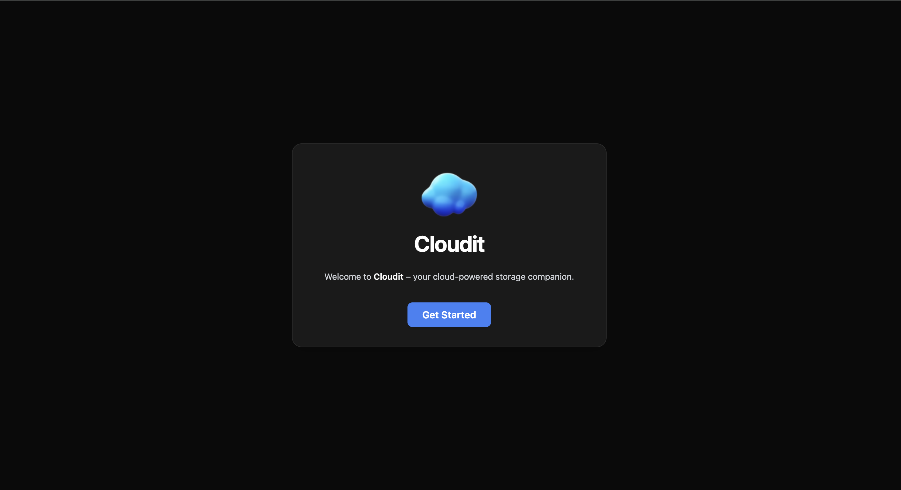
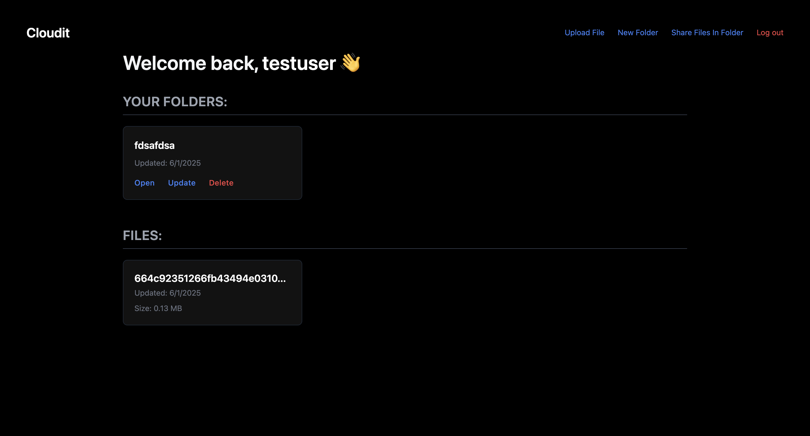

# Cloudit

Cloudit is a web-based cloud storage application that allows users to sign up, log in, and manage their personal files and folders. Built with Node.js, Express, Prisma, and PostgreSQL, Cloudit offers a user-friendly interface for organizing and accessing files securely.

---

🌐 **Live Demo**  
🔗 [View Deployed Site](https://cloudit-production.up.railway.app/)
- Currently being hosted on Railway with a the database by Neon
- Free Trial so host may be shut down once credits are gone

---

## 🚀 Features

- **User Authentication**: Secure sign-up and log-in functionality using Passport.js.
- **File Management**: Upload, download, and organize files into folders.
- **Folder Hierarchy**: Create nested folders to structure files effectively.
- **Session Management**: Persistent user sessions with PrismaSessionStore.
- **Database Integration**: Utilizes PostgreSQL with Prisma ORM for data management.
- **Share Folders and Files** : Provides a expiring share link for files and folders for non users.

## 🛠️ Tech Stack

- **Backend**: Node.js, Express.js
- **Authentication**: Passport.js
- **Database**: PostgreSQL, Prisma ORM, Cloudinary
- **Templating Engine**: EJS
- **Session Store**: PrismaSessionStore


---

## 📸 Screenshots

### 🏠 Homepage



### 📄 Library



---


## ⚙️ Installation

1. **Clone the repository**:
   ```bash
   git clone https://github.com/Kk120306/Cloudit.git
   cd Cloudit
   ```

2. **Install dependencies**:
   ```bash
   npm install
   ```

3. **Set up environment variables**:
   - Create a `.env` file in the root directory.
   - Add the following variables:
   ```ini
   DATABASE_URL=your_postgresql_database_url
   SESSION_SECRET=your_session_secret
   ```

4. **Set up the database**:
   - Push the Prisma schema to your database:
   ```bash
   npx prisma db push
   ```
   - Generate Prisma client:
   ```bash
   npx prisma generate
   ```

5. **Start the application**:
   ```bash
   npm start
   ```
   - The application will be running at `http://localhost:3000`.
